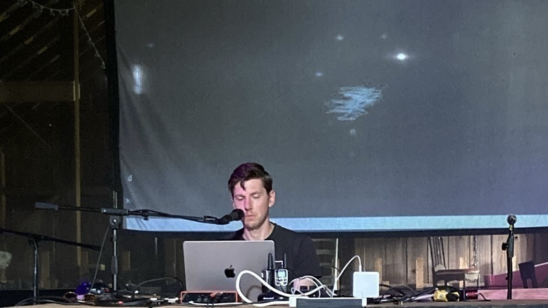

**words**

[William Hazard](../) makes poems with computers. Recent work can be found in the [_Moonstone Arts 2024 Featured Poets Anthology_](https://moonstone-arts-center.square.site/), [_At What Cost Catalog_](https://catalogs.atwhatcost.me/), [_Voicemail Poems_](https://voicemailpoems.org/), [_Bring a Blanket Zine_](https://www.instagram.com/bringablanketreadingseries/), [_Ghost Proposal_](https://ghostproposal.com/), [_Beloved Radio_](https://beloved.wtf/), [_Audio Flare Gun_](https://audioflaregun.com/), and on [GitHub](https://github.com/williamthazard/). He teaches at [Temple University](https://liberalarts.temple.edu/academics/departments-and-programs/intellectual-heritage). He hangs out at [llllllll.co](https://llllllll.co).

**photos**

