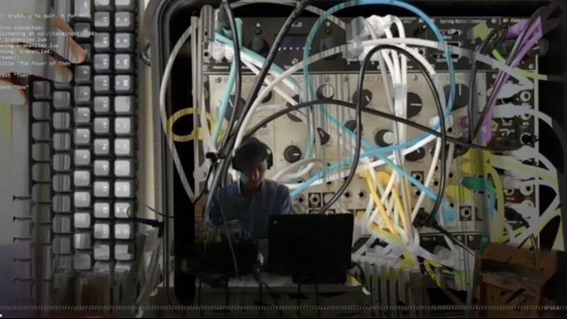

William Hazard makes poems with computers.
    
These poems involve [words](words).

They also involve [sounds](sounds).

These are interwoven with [code](code).

Sometimes, they're captured in [videos](videos).

Sometimes, they're shared in [performances](performances).

The rest of the time, there's a [log](log) [[rss](log/rss.xml)].
    
[buy tickets for the next flat imagination workshop here](https://www.eventbrite.com/e/-mix-lit-presents-a-flat-imagination-workshop-goodbye-mind-dani-derks-tickets-1116860623189?aff=oddtdtcreator)