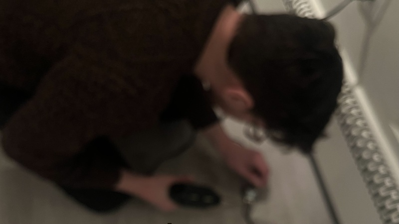

blurry process pic of me soldering a transducer for _settle_, a multimedia installation created in collaboration with Alexandra Wood at Philadelphia Small Works Gallery, opening tonight at 6pm. Thanks to [Souha Yan](https://memory-object.com) for helping me source these transducers. Thanks to [dani derks](https://dndrks.com) for helping me figure out the wiring. Thanks, also, to [Zack Scholl](https://infinitedigits.co), whose blog post on multichannel audio in supercollider on linux was very helpful.